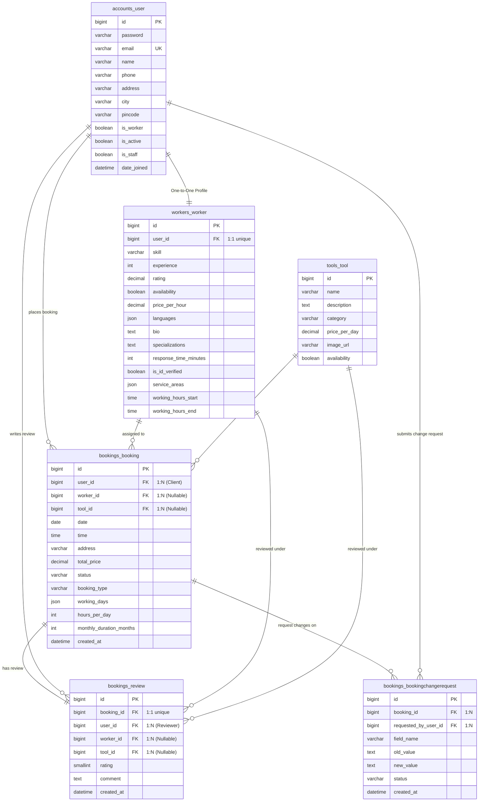

# ServiceLink Database Relations & SQL Reference Guide

This document serves as an academic and professional guide to the database architecture, entity relations, and SQL queries used in the **ServiceLink** marketplace system. 

It is designed to help you quickly understand and run SQL queries to demonstrate database integrity, relations, schemas, and analytical data to teachers or evaluators.

---

## 1. Database Overview
* **RDBMS Engine:** MySQL (accessible via command-line, MySQL Workbench, XAMPP, phpMyAdmin, or Django dbshell)
* **Database Name:** `servicelink`
* **Object-Relational Mapping (ORM):** Django Models mapped directly to MySQL tables.

---

## 2. Entity-Relationship (ER) Diagram

The following diagram showcases how tables in ServiceLink are linked together via **Primary Keys (PK)** and **Foreign Keys (FK)**, establishing **One-to-One (1:1)** and **One-to-Many (1:N)** relationships:



---

## 3. Core Tables Reference

| Table Name | Description | Key Fields & Relations |
| :--- | :--- | :--- |
| **`accounts_user`** | Main accounts table storing login credentials, roles, and personal contact details. Used for both Clients and Workers. | `id` (PK), `email` (Unique Key / Login ID). |
| **`workers_worker`** | Worker profiles storing their skill, rates, rating, experience, and hours. | `id` (PK), `user_id` (FK to `accounts_user`, UNIQUE - forms 1:1 relation). |
| **`tools_tool`** | Equipment/tools available for daily, weekly, or hourly rental. | `id` (PK). |
| **`bookings_booking`** | The transactional table recording bookings of either a Worker or a Tool by a Client. | `id` (PK), `user_id` (FK to client), `worker_id` (FK to worker, Nullable), `tool_id` (FK to tool, Nullable). |
| **`bookings_review`** | Feedback left by clients for completed bookings. | `id` (PK), `booking_id` (FK to booking, UNIQUE - forms 1:1 relation), `user_id` (FK to reviewer). |

---

## 4. How to Connect & Run Queries

If the teacher asks to see the database directly, run these commands:

### Option A: Using Django Shell (Simplest)
To quickly open the active MySQL database shell inside the virtual environment:
```powershell
python servicelink_backend/manage.py dbshell
```

### Option B: Using MySQL Direct CLI
```bash
mysql -u root -p
# Enter password if set (otherwise press enter)
USE servicelink;
```

---

## 5. Standard SQL Commands (Show Schema)

### Show All Tables
To list all active tables in the system:
```sql
SHOW TABLES;
```

### Describe Table Schema
To show the structure, data types, and primary/foreign keys of any table:
```sql
DESCRIBE accounts_user;
DESCRIBE workers_worker;
DESCRIBE bookings_booking;
```

### Show Active Foreign Keys and Relationships (High Value!)
Run this query to list all foreign keys in our database to prove to the teacher that the tables are properly normalized and linked:
```sql
SELECT 
    TABLE_NAME AS 'Table', 
    COLUMN_NAME AS 'Foreign Key', 
    REFERENCED_TABLE_NAME AS 'Referenced Table', 
    REFERENCED_COLUMN_NAME AS 'Referenced Key'
FROM 
    INFORMATION_SCHEMA.KEY_COLUMN_USAGE
WHERE 
    TABLE_SCHEMA = 'servicelink' 
    AND REFERENCED_TABLE_NAME IS NOT NULL;
```

---

## 6. Complex Queries & Relational Joins (Teacher's Favorites!)

Teachers love queries showing **INNER JOINs**, **LEFT JOINs**, **GROUP BY**, and **aggregate functions**. Below are the best queries to show.

### Query 1: The Worker Profile Join (One-to-One Relation)
**Goal:** Retrieve a list of all workers with their skill, price, experience, along with their names and contact details from the User table.
```sql
SELECT 
    w.id AS worker_id, 
    u.name AS worker_name, 
    u.email AS worker_email, 
    u.phone AS worker_phone, 
    u.city AS worker_city, 
    w.skill, 
    w.experience AS years_experience, 
    w.price_per_hour
FROM 
    workers_worker w
JOIN 
    accounts_user u ON w.user_id = u.id
ORDER BY 
    w.experience DESC;
```

### Query 2: The Booking Details Query (Many-to-One Joins)
**Goal:** Get a detailed overview of every booking: booking ID, date, status, total cost, client name, worker name (if worker booking), and tool name (if tool booking).
```sql
SELECT 
    b.id AS booking_id,
    b.date AS booking_date,
    b.time AS booking_time,
    b.status AS booking_status,
    b.total_price AS amount,
    u_client.name AS client_name,
    u_worker.name AS worker_name,
    t.name AS tool_name
FROM 
    bookings_booking b
JOIN 
    accounts_user u_client ON b.user_id = u_client.id
LEFT JOIN 
    workers_worker w ON b.worker_id = w.id
LEFT JOIN 
    accounts_user u_worker ON w.user_id = u_worker.id
LEFT JOIN 
    tools_tool t ON b.tool_id = t.id
ORDER BY 
    b.created_at DESC;
```

### Query 3: Workers Earnings & Booking Aggregates (GROUP BY & Count)
**Goal:** Calculate the total number of bookings and aggregate earnings for each worker, showing who the top performer is.
```sql
SELECT 
    w.id AS worker_id,
    u.name AS worker_name,
    w.skill,
    COUNT(b.id) AS total_bookings_received,
    SUM(CASE WHEN b.status = 'completed' THEN b.total_price ELSE 0 END) AS total_completed_earnings,
    AVG(w.rating) AS avg_rating
FROM 
    workers_worker w
JOIN 
    accounts_user u ON w.user_id = u.id
LEFT JOIN 
    bookings_booking b ON b.worker_id = w.id
GROUP BY 
    w.id, u.name, w.skill
ORDER BY 
    total_completed_earnings DESC;
```

### Query 4: Detailed Customer Feedback (Double Join & Validation)
**Goal:** Show all reviews submitted by clients, including client name, worker name (being reviewed), rating, and feedback comment.
```sql
SELECT 
    r.id AS review_id,
    b.id AS booking_id,
    u_client.name AS reviewer_name,
    u_worker.name AS worker_reviewed,
    r.rating AS stars,
    r.comment AS feedback_text
FROM 
    bookings_review r
JOIN 
    bookings_booking b ON r.booking_id = b.id
JOIN 
    accounts_user u_client ON r.user_id = u_client.id
LEFT JOIN 
    workers_worker w ON r.worker_id = w.id
LEFT JOIN 
    accounts_user u_worker ON w.user_id = u_worker.id
ORDER BY 
    r.rating DESC;
```

### Query 5: Location-Based Worker Availability Search (Filtering)
**Goal:** Search for all available electricians in a particular city (e.g., 'Bengaluru') sorting them by experience and pricing.
```sql
SELECT 
    w.id AS worker_id,
    u.name AS name,
    u.city AS city,
    w.skill AS service,
    w.price_per_hour AS hourly_rate,
    w.experience AS years_experience
FROM 
    workers_worker w
JOIN 
    accounts_user u ON w.user_id = u.id
WHERE 
    w.availability = TRUE 
    AND w.skill = 'electrician' 
    AND u.city = 'Bengaluru'
ORDER BY 
    w.price_per_hour ASC;
```

### Query 6: Find Pending Booking Change Requests
**Goal:** View all change requests made to bookings that are currently waiting for approval, showing the old and new requested values and client details.
```sql
SELECT 
    cr.id AS request_id,
    cr.booking_id,
    u.name AS requested_by,
    cr.field_name AS changed_field,
    cr.old_value,
    cr.new_value,
    cr.status AS request_status
FROM 
    bookings_bookingchangerequest cr
JOIN 
    accounts_user u ON cr.requested_by_user_id = u.id
WHERE 
    cr.status = 'pending';
```

---

## 7. Sample CRUD Scenarios (Insert, Update, Delete)

If the teacher asks to see how data is inserted or updated using SQL query syntax:

### 1. Register a New User
```sql
INSERT INTO accounts_user (password, is_superuser, name, email, phone, address, city, pincode, is_worker, is_active, is_staff, date_joined) 
VALUES ('pbkdf2_sha256$somehash...', FALSE, 'Rohan Sharma', 'rohan@example.com', '9876543210', '123 MG Road', 'Bengaluru', '560001', TRUE, TRUE, FALSE, NOW());
```

### 2. Promote the Registered User to a Worker Profile
```sql
-- Assume the inserted user's ID was 5
INSERT INTO workers_worker (user_id, skill, experience, rating, availability, price_per_hour, languages, bio, specializations, response_time_minutes, is_id_verified, service_areas) 
VALUES (5, 'plumber', 6, 4.50, TRUE, 250.00, '["English", "Hindi"]', 'Experienced in residential fittings.', 'Leaking pipes, washbasin installation', 10, TRUE, '["MG Road", "Indiranagar"]');
```

### 3. Create a Booking for this Worker
```sql
-- Client ID is 2, Worker ID is 1
INSERT INTO bookings_booking (user_id, worker_id, tool_id, date, time, address, total_price, status, booking_type, working_days, hours_per_day, created_at)
VALUES (2, 1, NULL, '2026-06-01', '10:00:00', '456 Residency Rd, Bengaluru', 500.00, 'pending', 'hourly', '["Mon"]', 2, NOW());
```

### 4. Accept / Confirm the Booking
```sql
UPDATE bookings_booking 
SET status = 'confirmed' 
WHERE id = 1;
```
